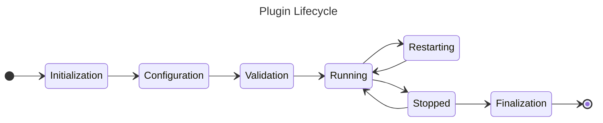

# Plugins

This section provides an overview of how to create and manage plugins for the ACME CSE. Plugins allow you to extend the functionality of the CSE without modifying its core codebase. 

## Introduction 

Plugins can be used to add new features, modify existing behavior, or integrate with external systems. They can interact with the CSE's internal APIs and lifecycle events to provide seamless extensions. Plugins have a well-defined lifecycle, including initialization, configuration, activation, deactivation, and cleanup phases.

Plugins are standard Python modules that are placed in a *plugins* directory within the CSE's base directory. The CSE automatically loads and integrates these plugins at startup. They are loaded in the Python module namespace `acme.plugins.<plugin_name>`. Plugins are loaded and processed in alphabetical case-insensitive order based on their filenames.


### Plugin Directories

There are two locations where the CSE looks for plugins:

- The internal *plugins* directory located within the CSE installation path at `acme/plugins`. This directory is used for plugins that are bundled with the CSE. You should **not** modify or add plugins to this directory, as they may be overwritten during CSE updates.
- The external *plugins* directory located in the CSE's base directory (the directory from which the CSE is started or specified with the [--base-directory <directory>](../setup/Running.md#different-base-directory) command line option). This directory is intended for user-defined plugins. 

Even if these are two different directories, they are treated equally by the CSE. Plugins from both directories are loaded and managed in the same way. The only (runtime) difference is the order in which they are loaded: Plugins from the internal directory are loaded first, followed by plugins from the external directory. This means that plugins in the external directory can override plugins with the same name in the internal directory, but only if this is allowed by the configuration setting described in the next section.


### Replacing Loaded Plugins

All plugins are loaded under the same Python module namespace `acme.plugins` and must therefore all have unique names. If there are plugins with the same name in both directories, a Python Exception will be raised during CSE startup. This behaviour can be changed by setting the configuration option [\[cse.operation.plugins\].replace](../setup/Configuration-cse.md#plugins) to `true`. 


### Disabling Plugins

Plugins can be disabled by adding them to the configuration option [\[cse.operation.plugins\].disabledPlugins](../setup/Configuration-cse.md#plugins). Plugins listed in this configuration setting will not be loaded by the CSE at startup. 

Names of disabled plugins must match the plugin module name (i.e., the filename without the `.py` extension). Simple wildcard patterns (e.g., `MyPlugin*`) can be used to disable multiple plugins at once.

```ini title="Example Configuration to Disable Plugins"
[cse.operation.plugins]
disabledPlugins = APlugin,MyPlugin*, AnotherPlugin
```

## Developing an Example Plugin

The programming language for plugins is Python, the same as for the ACME CSE itself. To create a new plugin, follow the steps below. We will create a simple example plugin that will log a message when the CSE starts up and shuts down.

### Creating a Plugin Module

Create a new Python module in the `plugins` folder of your working directory.

For example, if your plugin is named `HelloWorld`, create a file named `HelloWorld.py` in the `plugins` directory.

### Writing the Plugin Code

In your plugin module, you need to define a class that is decorated with `@PluginManager.runnableClass`. This class will contain methods that are decorated to hook into the CSE's lifecycle events.

```python title="HelloWorld.py" linenums="1"
from acme.runtime import PluginManager
from acme.runtime.Logging import Logging as L

@PluginManager.pluginClass
class HelloWorldPlugin:

    @PluginManager.init
    def init(self) -> None:
        L.log('HelloWorld plugin initialized')

    @PluginManager.finish
    def finish(self) -> None:
        L.log('HelloWorld plugin finished')

    @PluginManager.start
    def start(self) -> None:
        L.log('Hello, world!')

    @PluginManager.stop
    def stop(self) -> None:
        L.log('Goodbye, world!')
```

In this example, the `HelloWorld` class is decorated with `@PluginManager.pluginClass`, indicating that it is a plugin class. There can only be one plugin class per plugin module. This class will automatically be instantiated by the `PluginManager` when the plugin is loaded.

The class has four methods that are decorated to hook into the CSE's lifecycle events: `init`, `finish`, `start`, and `stop`. Each method logs a message to the ACME logging system when the CSE starts up and shuts down.


### Running the Plugin

To run the plugin, start or restart the ACME CSE with the working directory containing your `plugins` folder. You should see log messages indicating that the plugin has been loaded, and the class has been instantiated, initialized, and started. When you shutdown the CSE, you should see log messages indicating that the plugin has been stopped and finished.

The log output should look similar to the following:

```text title="ACME CSE Log Output"
...
INFO    MainThread - HelloWorld plugin initialized              HelloWorld.py:9
INFO    MainThread - Hello, world!                              HelloWorld.py:17
...
INFO    MainThread - Goodbye, world!                            HelloWorld.py:21
INFO    MainThread - HelloWorld plugin finished                 HelloWorld.py:13
...
```

## The PluginManager

The `PluginManager` is the  component of the ACME CSE that is responsible for managing the lifecycle of plugins. It provides decorators, methods and properties that plugins can use to hook into the CSE's lifecycle events. It is loaded and run as part of the CSE's startup process. Similar, it is finalized during the CSE's shutdown process.

The PluginManager offers the possibility to access loaded plugins and their assigned plugin classes at runtime. This can be useful for plugins that need to interact with other plugins or for debugging purposes.

How to access loaded plugins and their plugin classes is described in the following sections.


### Getting Plugin Information

The `PluginManager` provides a way to access the runtime information of loaded plugins. This includes the ability to get the Python module, but also other information such as the plugin's name and its associated plugin class. This can be useful for introspection or for dynamically loading additional resources from the plugin's module.

Plugin information can be accessed through the `PluginManager.<PluginName>` property, where `<PluginName>` is the name of the plugin module (i.e., the filename without the `.py` extension).


```python title="Getting Plugin Python Module"
from acme.runtime import PluginManager

# Get the module for a specific plugin
hello_world_info = PluginManager.HelloWorld
hello_world_module = hello_world_info.module
```

The `hello_world_module` variable will now contain the Python module object for the `HelloWorld` plugin, allowing access to its Python attributes, classes, and functions. 

The plugin information contains additional properties, including the current plugin state, pointers to the decorated lifecycle methods, and the instantiated plugin class.


### Accessing the Plugin Class

The PluginManager always instantiates the plugin's class that is decorated with `@PluginManager.pluginClass` when the plugin is loaded. By default it is only accessible via Plugin information, but it is not directly exposed for access.

However, it is possible to pass a name for a property in the `@PluginManager.pluginClass` decorator, which will cause the instantiated plugin class to be accessible via a property with that name.

For example, the `HelloWorld` plugin class can be decorated as follows:

```python title="HelloWorld.py with Named Plugin Class"
from acme.runtime import PluginManager

@PluginManager.pluginClass(property='greetings')
class HelloWorld:
    ...
```

The instantiated plugin class can then be accessed via the `PluginManager.greetings` property:

```python title="Getting Named Plugin Class"
hello_world_instance = PluginManager.greetings
```


### Setting the Plugin Class Priority

By default, the `PluginManager` instantiates and processes plugin classes in the order they are loaded. However, it is possible to set a priority for the plugin class instantiation using the `priority` parameter in the `@PluginManager.pluginClass` decorator. This can be useful if a plugin class depends on another plugin class being instantiated first.

Plugin classes with a lower priority value are instantiated before those with a higher priority value. The default priority is `50`.

```python title="HelloWorld.py with Priority"
from acme.runtime import PluginManager

@PluginManager.pluginClass(priority=10)
class HelloWorld:
	...
```

In this example, the `HelloWorld` plugin class will be instantiated before any other plugin classes with the default priority of, for example, `50`.

It is important to note that plugin classes with a lower priority value are instantiated first, but are stopped and finalized later during the CSE shutdown or unloading process. 


### Getting All Plugin Information

The information of all loaded plugins can be accessed via the `PluginManager.plugins` property. This is a list of `PluginInfo` objects, each containing information about a loaded plugin, including its name, module, state, and associated plugin class.

Usually, this is only needed for debugging or introspection purposes.

```python title="Getting Plugin Information"
from acme.runtime import PluginManager

# Get a list of all loaded plugins
loaded_plugins = PluginManager.plugins
```


## Plugin Lifecycle & API

Plugins in the ACME CSE follow the same lifecycle as the CSE itself, consisting of several phases
that are shown in the following diagram.  



The phases of the plugin lifecycle are implemented as methods within the plugin class, each decorated with specific decorators provided by the `PluginManager`. A plugin can implement none, some, or all of the lifecycle methods.

Plugins run in the same thread as the main CSE process, so be careful not to block the main thread within plugin methods. If you need to perform long-running tasks, consider using separate threads or asynchronous programming techniques.


### Initialization

The plugin is loaded and initialized when the CSE starts. The `@PluginManager.init` decorated method is called during this phase.

The signature of the `@PluginManager.init` method is as follows:

```python title="Plugin Initialization Decorator"
@PluginManager.init
def init(self) -> None:
    ...
```

### Configuration

The plugin can read configuration settings from the CSE's configuration file during this phase. The `@PluginManager.configure` decorated method is called during this phase with the `acme.runtime.Configuration.Configuration` object as an argument. This method should raise an exception if required configuration settings are missing or invalid.

The signature of the `@PluginManager.configure` method is as follows:

```python title="Plugin Configuration Decorator"
@PluginManager.configure
def configure(self, config: Configuration) -> None:
    ...
```


### Validation

The plugin can validate its configuration settings during this phase. The `@PluginManager.validate` decorated method is called during this phase with the `acme.runtime.Configuration.Configuration` object as an argument, and therefore has access to ACME's configuration settings. This method should raise an exception if the configuration is invalid.

This phase occurs after configuration and before activation. The plugin can use this phase to ensure that all necessary configuration settings are present and inline with other configuration settings.

The signature of the `@PluginManager.validate` method should be as follows:

```python title="Plugin Validation Decorator"
@PluginManager.validate
def validate(self, config: Configuration) -> None:
    ...
```


### Running

The plugin becomes active and starts performing its intended functions. The `@PluginManager.start` decorated method is called during this phase.

The signature of the `@PluginManager.start` method is as follows:

```python title="Plugin Start Decorator"
@PluginManager.start
def start(self) -> None:
    ...
```


### Stopped

The plugin is deactivated and stops performing its functions. The `@PluginManager.stop` decorated method is called during this phase.

The signature of the `@PluginManager.stop` method is as follows:

```python title="Plugin Stop Decorator"
@PluginManager.stop
def stop(self) -> None:
    ...
```

### Restarting

If the CSE is restarted internally, the plugin's `@PluginManager.restart` decorated method is called. This allows the plugin to reinitialize any state or resources as needed. After this method is called, the plugin is considered to be in the running state again. However, neither the `@PluginManager.start` nor `@PluginManager.stop` methods are called during a restart.

The signature of the `@PluginManager.restart` method is as follows:

```python title="Plugin Restart Decorator"
@PluginManager.restart
def restart(self) -> None:
    ...
```

### Finalization

The plugin is finalized and cleaned up when the CSE shuts down. The `@PluginManager.finish` decorated method is called during this phase. This is the last phase of the plugin's lifecycle.

The signature of the `@PluginManager.finish` method is as follows:

```python title="Plugin Finalization Decorator"
@PluginManager.finish
def finish(self) -> None:
    ...
```
