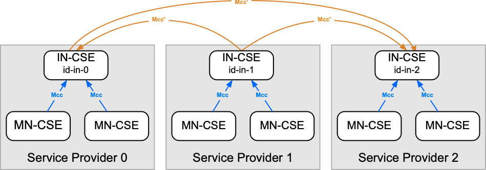

# How to Interconnect Service Providers

A normal oneM2M deployment consists of a set of oneM2M nodes that are connected to each other in a tree-like structure, consisting of a root infrastructure node (IN-CSE) and several child nodes that can be either middle nodes (MN-CSE), application service nodes (ASN-CSE), or application dedicated nodes (ADN-CSE).


## Service Provider Registrations

oneM2M defines a mechanism to interconnect different oneM2M deployment trees. This is done by registering an IN-CSE of one service provider deployment with an IN-CSE of another service provider deployment. This can be done multiple times, allowing a node to connect to multiple other nodes.

The following figure illustrates this concept.

<figure markdown="1">

<figcaption>oneM2M Registrations</figcaption>
</figure>

The CSEs of a single service provider can register with each other via the *Mcc* reference point (the blue connections in the figure). The top-level IN-CSE of each service provider can then regiser itself with the IN-CSE of another service provider via the *Mcc'*[^1] reference point (the orange connections in the figure).

[^1]: *Mcc'* is pronounced *Mcc prime*


## Configuration

The configuration of the service provider registration is done in a similar way as a configuration to a normal registrar CSE within a single oneM2M deployment. 

The difference is that one needs to specify one or two sections in the configuration file. The name of each section is important, as it is used to distinguish the different service provider registrations. The section names must start with `cse.sp.registrar.` followed by a unique identifier for that particular service provider registration.

In the exampkes below, we use **"Service Provider 0"** as the local service provider, and **"Service Provider 1"** as the remote service provider that we want to register with. 

More details about these configuration settings can be found in the configuration documentation for [Service Provider Registrations](../setup/Configuration-cse.md#service-provider-registrations) and [Service Provider Security](../setup/Configuration-cse.md#service-provider-security-settings).


### Service Provider Section

There must be at least one configuration section for the service provider registration itself, which contains the information about the remote IN-CSE. 

A minimum configuration section for a service provider registration could look like this:

```ini title="Example Service Provider Registration Configuration"
[cse.sp.registrar.exampleProvider1]

; The remote IN-CSE's service provider ID, address, CSE ID, resource name and serialization format
spID = //provider1.example.com
address = https://provider1.example.com:8080
cseID = /id-in-sp1
resourceName = cse-in-sp1
serialization = json
```

### Security Section

Optionally, a second section can be provided to specify security information for connecting to the remote IN-CSE, such as the security scheme and credentials.

An example security section for the service provider connection specified above that uses HTTPS with a self-signed certificate and basic authentication
could look like this:

```ini title="Example Service Provider Security Configuration"
[cse.sp.registrar.exampleProvider1.security]

; This is our user name and password that we use to authenticate with the remote IN-CSE
httpUsername = sp0User
httpPassword = hashedPassword0

; This is the user name and password that the remote IN-CSE uses to authenticate with us
selfHttpUsername = spUser1
selfHttpPassword = hashedPassword1
```


### Authorize Service Provider Registrations

As with every registration, the registering CSE must be authorized to register with the remote IN-CSE. This is done by adding the CSE's ID to the *allowedCSROriginators* setting in the *\[cse.registration]* section of the remote IN-CSE's configuration file.

The registrar CSE's ID does **not** need to be added to the local CSE's *allowedCSROriginators* setting. This is automatically done internally by the CSE when the registration is successful.

