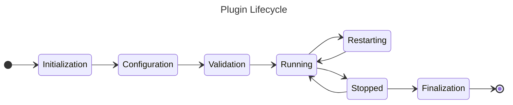

# Plugin API & Lifecycle

Plugins in the ACME CSE follow the same lifecycle as the CSE itself, consisting of several phases
that are shown in the following diagram.  



The phases of the plugin lifecycle are implemented as methods within the plugin class, each decorated with specific decorators provided by the `PluginManager`. A plugin can implement none, some, or all of the lifecycle methods.

Plugins run in the same thread as the main CSE process, so be careful not to block the main thread within plugin methods. If you need to perform long-running tasks, consider using separate threads or asynchronous programming techniques.


## Class Decorator

A single class within the plugin module must be decorated with `@PluginManager.pluginClass` to indicate that it is the plugin class. This class will be instantiated by the `PluginManager` when the plugin is loaded. Within this class, you can define methods that are decorated to hook into the various lifecycle events of the plugin.

The class can have any name, but it is common practice to name it after the plugin itself (e.g., `HelloWorldPlugin` for a plugin named `HelloWorld`). The class can also have an `__init__` method for any necessary initialization, but keep in mind that the lifecycle methods will be called after the class is instantiated, so any setup that depends on the CSE's state should be done in the appropriate lifecycle method rather than in `__init__`.

The `@PluginManager.pluginClass` decorator can also take optional parameters, such as `property` to specify a property name for accessing the instantiated plugin class, and `priority` to set the instantiation priority of the plugin class. 

If no property name is provided, the plugin class will not be directly accessible via a property on the `PluginManager`, but it can still be accessed through the plugin information as described in the [PluginManager documentation](PluginManager.md#accessing-plugin-information-and-modules). 

If no priority is provided, the default priority of `50` will be used. A lower priority value means that the plugin class will be instantiated earlier than those with a higher priority value. This can be useful if your plugin class depends on another plugin class being instantiated first.

```python title="Plugin Class Decorator with Parameters"
@PluginManager.pluginClass(property='my_plugin', priority=10)
class MyPlugin:
	...
```


## Decorators for Lifecycle Methods

### Initialization

The plugin is loaded and initialized when the CSE starts. The `@PluginManager.init` decorated method is called during this phase.

The signature of the `@PluginManager.init` method is as follows:

```python title="Example: Plugin Initialization Decorator"
@PluginManager.init
def init(self) -> None:
    ...
```

### Configuration

The plugin can read configuration settings from the CSE's configuration file during this phase. The `@PluginManager.configure` decorated method is called during this phase with the `acme.runtime.Configuration.Configuration` object as an argument. This method should raise an exception if required configuration settings are missing or invalid.

The signature of the `@PluginManager.configure` method is as follows:

```python title="Example: Plugin Configuration Decorator"
@PluginManager.configure
def configure(self, config: Configuration) -> None:
    ...
```


### Validation

The plugin can validate its configuration settings during this phase. The `@PluginManager.validate` decorated method is called during this phase with the `acme.runtime.Configuration.Configuration` object as an argument, and therefore has access to ACME's configuration settings. This method should raise an exception if the configuration is invalid.

This phase occurs after configuration and before activation. The plugin can use this phase to ensure that all necessary configuration settings are present and inline with other configuration settings.

The signature of the `@PluginManager.validate` method should be as follows:

```python title="Example: Plugin Validation Decorator"
@PluginManager.validate
def validate(self, config: Configuration) -> None:
    ...
```


### Running

The plugin becomes active and starts performing its intended functions. The `@PluginManager.start` decorated method is called during this phase.

The signature of the `@PluginManager.start` method is as follows:

```python title="Example: Plugin Start Decorator"
@PluginManager.start
def start(self) -> None:
    ...
```


### Stopped

The plugin is deactivated and stops performing its functions. The `@PluginManager.stop` decorated method is called during this phase.

The signature of the `@PluginManager.stop` method is as follows:

```python title="Example: Plugin Stop Decorator"
@PluginManager.stop
def stop(self) -> None:
    ...
```

### Restarting

If the CSE is restarted internally, the plugin's `@PluginManager.restart` decorated method is called. This allows the plugin to reinitialize any state or resources as needed. After this method is called, the plugin is considered to be in the running state again. However, neither the `@PluginManager.start` nor `@PluginManager.stop` methods are called during a restart.

The signature of the `@PluginManager.restart` method is as follows:

```python title="Example: Plugin Restart Decorator"
@PluginManager.restart
def restart(self) -> None:
    ...
```

### Finalization

The plugin is finalized and cleaned up when the CSE shuts down. The `@PluginManager.finish` decorated method is called during this phase. This is the last phase of the plugin's lifecycle.

The signature of the `@PluginManager.finish` method is as follows:

```python title="Example: Plugin Finalization Decorator"
@PluginManager.finish
def finish(self) -> None:
    ...
```
