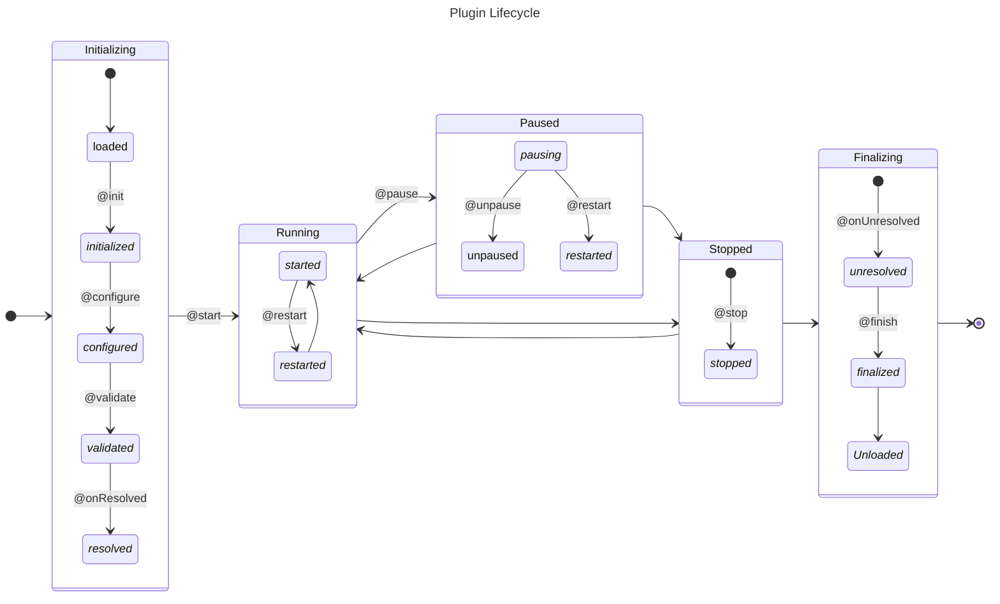

# Plugin API & Lifecycle

Plugins in the ACME CSE follow the same lifecycle as the CSE itself, consisting of several phases
that are shown in the following diagram.  




The phases of the plugin lifecycle are implemented as methods within the plugin class, each decorated with specific decorators provided by the [PluginManager](https://api.acmecse.net/acmecse.helpers.PluginManager.PluginManager.html){target="_new"}. A plugin can implement none, some, or all of the lifecycle methods.

Plugins run in the same thread as the main CSE process, so be careful not to block the main thread within plugin methods. If you need to perform long-running tasks, consider using separate threads or asynchronous programming techniques.


## Plugin Class Decorators

### @plugin

A single class within the plugin module must be decorated with [@PluginManager.plugin](https://api.acmecse.net/acmecse.helpers.PluginManager.html#plugin){target="_new"} to indicate that it is the plugin class. This class will be instantiated by the [PluginManager](https://api.acmecse.net/acmecse.runtime.PluginManager.PluginManager.html){target="_new"} when the plugin is loaded. Within this class, you can define methods that are decorated to hook into the various lifecycle events of the plugin.

The class can have any name, but it is common practice to name it after the plugin itself (e.g., `HelloWorldPlugin` for a plugin named `HelloWorld`). The class can also have an `__init__` method for any necessary initialization, but keep in mind that the lifecycle methods will be called after the class is instantiated, so any setup that depends on the CSE's state should be done in the appropriate lifecycle method rather than in `__init__`.

#### Decorator Arguments

The [@PluginManager.plugin](https://api.acmecse.net/acmecse.helpers.PluginManager.html#plugin){target="_new"}
class decorator can also take optional parameters, which are passed as keyword arguments. 

- `property`: A string that specifies the name of a property on the [PluginManager](https://api.acmecse.net/acmecse.runtime.PluginManager.PluginManager.html){target="_new"} through which the instantiated plugin class can be accessed. If this parameter is not provided, the plugin class will not be directly accessible via a property on the `PluginManager`.  
	If no property name is provided, the plugin class will not be directly accessible via a property on the [PluginManager](https://api.acmecse.net/acmecse.runtime.PluginManager.PluginManager.html){target="_new"}, but it can still be accessed through the plugin information as described in the [PluginManager documentation](PluginManager.md#accessing-plugin-information-and-modules). 
- `priority`: An integer that specifies the priority of the plugin class instantiation. Plugin classes with a lower priority value are instantiated before those with a higher priority value. The default priority is `50`. This can be useful if your plugin class depends on another plugin class being instantiated first.
- `tags`: A list of strings that can be used to tag the plugin class with specific keywords. This can be useful for categorizing plugins or for filtering plugins based on their tags at runtime.
- `noRestartWhilePaused`: Normally, plugins can be restarted while paused. This flag indicates that the plugin should not be restarted while in paused state. This can be useful for plugins that maintain state that should not be reset while paused.

#### Example 

```python title="Plugin Class Decorator with Parameters"
@PluginManager.plugin(property='my_plugin', 
					  priority=10, 
					  tags=['example', 'test'], 
					  noRestartWhilePaused=True)
class MyPlugin:
	...
```

### @requires

The [@PluginManager.requires](https://api.acmecse.net/acmecse.helpers.PluginManager.html#requires){target="_new"} class decorator can be used to specify that a plugin depends on another plugin. This ensures that the dependent plugin is resolved before the plugin is started. If the required plugin is not available, the whole startup process will fail with an error. This behaviour can be changed by setting the optional argument `required` to `False`, which will cause the plugin to be processed as usual, though the dependency is not resolved.

One important aspect of using the [@requires](https://api.acmecse.net/acmecse.helpers.PluginManager.html#requires){target="_new"} class decorator is that the dependency plugin's instance is injected into the decorated class as an attribute with the same name as the argument in the [@requires](https://api.acmecse.net/acmecse.helpers.PluginManager.html#requires){target="_new"} decorator. If the dependend plugin becomes unavailable, the attribute will be set to `None`.

See the following examples for more details.

The [@requires](https://api.acmecse.net/acmecse.helpers.PluginManager.html#requires){target="_new"} decorator can be used multiple times together with the [@plugin](#plugin) decorator for the same class, or even without the [@plugin](#plugin) decorator for non-plugin classes. 

#### Using `@requires` with a Non-Plugin Class

In case a class is not a plugin itself, the [@requires](https://api.acmecse.net/acmecse.helpers.PluginManager.html#requires){target="_new"} decorator can be used to express dependencies to plugins and to have the plugin instances automatically injected into the class. This can be useful for classes that depend on the functionality provided by a plugin and want to access plugin instances directly.

A plugin or non-plugin class can monitor the availability of its dependencies by using the [@onResolved](#onresolved) and [@onUnresolved](#onunresolved) decorators, which are called when all dependencies are resolved and when any dependency becomes unresolved, respectively. This allows the class to react to changes in the availability of its dependencies at runtime.


#### Using `@requires` with Functions

The [@requires](https://api.acmecse.net/acmecse.helpers.PluginManager.html#requires){target="_new"} decorator can also be used to specify dependencies to functions (instead of a whole plugin), by setting the keyword argument in the [@plugin](#plugin) decorator to a function path instead of a plugin module name. The function will then be injected as an attribute into the decorated class, and can be called directly from the class methods. This can be useful for providing specific functionality to classes without requiring them to depend on an entire plugin, or to have to import the function directly.

The function that is being depended on must be decorated with the [@provide](#provide) decorator. A function can be defined in any module, and does not need to be defined within a plugin module. 


#### Decorator Arguments

The [@requires](https://api.acmecse.net/acmecse.helpers.PluginManager.html#requires){target="_new"} class decorator takes keyword arguments: 

- `<attribute name> = <plugin name>`: the keyword name is the name of the attribute through which the plugin instance will be injected into the decorated class, and the value is the name of the required plugin. The plugin name must match the plugin module name (i.e., the filename without the `.py` extension).  
	This is a required argument, and can occur multiple times to specify multiple dependencies.
- `required`: A boolean that indicates whether the dependency is required for the plugin to function. If set to `True`, the whole startup process will fail with an error if the required plugin is not available. If set to `False`, the plugin will be processed as usual, though the dependency is not resolved. The default value is `True`.


#### Example: Plugin Class with Dependency

```python title="Plugin Class Decorator with Dependency"
@PluginManager.plugin	                                                    # Mark the class as a plugin class
@PluginManager.requires(dependency_plugin='acmecse.plugins.DependencyPlugin')	# Plugin depends on 'DependencyPlugin'
class MyPlugin:

	def aFunction(self):
		# Access the instance of the dependency plugin via the injected attribute
		self.dependency_plugin.someFunction()
```


#### Example: Non-Plugin Class with Dependency

```python title="Non-Plugin Class Decorator with Dependency"
@PluginManager.requires(dependency_plugin='acmecse.plugins.DependencyPlugin')	# Class depends on 'DependencyPlugin'
class MyClass:

	def aFunction(self):
		# Access the instance of the dependency plugin via the injected attribute
		self.dependency_plugin.someFunction()
```


#### Example: Optional Dependency on Multiple Plugins

```python title="Optional Dependency on Multiple Plugins"
@PluginManager.requires(dependency_plugin1='acmecse.plugins.DependencyPlugin1', 
						dependency_plugin2='acmecse.plugins.DependencyPlugin2',
						required=False)	# Optional
class MyClass:

	# Adding attributes for easier checking of whether the dependencies are resolved or not
	dependency_plugin1 = None
	dependency_plugin2 = None

	def aFunction(self):
		# The following will only call someFunction() if the dependencies are resolved,
		# otherwise it will do nothing, as the attributes will be None
		self.dependency_plugin1 and self.dependency_plugin1.someFunction()	
		self.dependency_plugin2 and self.dependency_plugin2.someFunction()
```


#### Example: Providing a Function

```python title="Dependency on a Provided Function"

# Mark the function as a provided function
@PluginManager.provide('a.path.to.provided_function')	
def provided_function(arg1, arg2) -> ReturnType:
	...

# Define a dependency on a provided function
@PluginManager.plugin
@PluginManager.requires(provided_function='a.path.to.provided_function')	
class MyPlugin:
	def aFunction(self):
		# Call the provided function via the injected attribute
		self.provided_function(arg1, arg2)
```

## Decorators for Lifecycle Methods

### @init - Initialization

The plugin is loaded and initialized when the CSE starts. The [@init](https://api.acmecse.net/acmecse.helpers.PluginManager.html#init){target="_new"} decorated method is called during this phase.

The signature of the decorated method is as follows:

```python title="Example: Plugin Initialization Decorator"
@PluginManager.init
def init(self) -> None:
    ...
```

### @configure - Configuration

The plugin can read configuration settings from the CSE's configuration file during this phase. The [@configure](https://api.acmecse.net/acmecse.helpers.PluginManager.html#configure){target="_new"} decorated method is called during this phase with the `acmecse.runtime.Configuration.Configuration` instance as an argument. This method should raise an exception if required configuration settings are missing or invalid.

The signature of the decorated method is as follows:

```python title="Example: Plugin Configuration Decorator"
@PluginManager.configure
def configure(self, config: Configuration) -> None:
    ...
```


### @validate - Validation

The plugin can validate its configuration settings during this phase. The [@validate](https://api.acmecse.net/acmecse.helpers.PluginManager.html#validate){target="_new"} decorated method is called during this phase with the `acmecse.runtime.Configuration.Configuration` object as an argument, and therefore has access to ACME's configuration settings. This method should raise an exception if the configuration is invalid.

This phase occurs after configuration and before activation. The plugin can use this phase to ensure that all necessary configuration settings are present and inline with other configuration settings.

The signature of the decorated method is as follows:

```python title="Example: Plugin Validation Decorator"
@PluginManager.validate
def validate(self, config: Configuration) -> None:
    ...
```


### @start - Running

The plugin becomes active and starts performing its intended functions. The [@start](https://api.acmecse.net/acmecse.helpers.PluginManager.html#start){target="_new"} decorated method is called during this phase.

The signature of the decorated method is as follows:

```python title="Example: Plugin Start Decorator"
@PluginManager.start
def start(self) -> None:
    ...
```


### @pause - Paused

The plugin is paused and temporarily stops performing its functions. The [@pause](https://api.acmecse.net/acmecse.helpers.PluginManager.html#pause){target="_new"} decorated method is called during this phase.

The signature of the decorated method is as follows:

```python title="Example: Plugin Pause Decorator"
@PluginManager.pause
def pause(self) -> None:
    ...
```


### @unpause - Unpaused

The plugin is unpaused and resumes performing its functions. The [@unpause](https://api.acmecse.net/acmecse.helpers.PluginManager.html#unpause){target="_new"} decorated method is called during this phase.

!!! note "Unpause not called when Restarting while Paused"
	If the plugin is in *paused* state and the plugin is restarted while paused, the [@restart](https://api.acmecse.net/acmecse.helpers.PluginManager.html#restart){target="_new"} method will be called, but the [@unpause](https://api.acmecse.net/acmecse.helpers.PluginManager.html#unpause){target="_new"} method will not be called.
	
The signature of the decorated method is as follows:

```python title="Example: Plugin Unpause Decorator"
@PluginManager.unpause
def unpause(self) -> None:
	...
```


### @stop - Stopped

The plugin is deactivated and stops performing its functions. The [@stop](https://api.acmecse.net/acmecse.helpers.PluginManager.html#stop){target="_new"} decorated method is called during this phase.

If the plugin is in *paused* state and the [@plugin](#plugin) class decorator has the `noRestartWhilePaused` argument set to `True`, the plugin will not be restarted while paused.

The signature of the decorated method is as follows:

```python title="Example: Plugin Stop Decorator"
@PluginManager.stop
def stop(self) -> None:
    ...
```

### @restart - Restarting

If the CSE is restarted internally, the plugin's [@restart](https://api.acmecse.net/acmecse.helpers.PluginManager.html#restart){target="_new"} decorated method is called. This allows the plugin to reinitialize any state or resources as needed. After this method is called, the plugin is considered to be in the running state again. However, neither the [@start](#start---running) nor [@stop](#stop---stopped) methods are called during a restart.

!!! note "Not restarting while Paused"
	If the plugin is in *paused* state and the [@plugin](#plugin) class decorator has the `noRestartWhilePaused` flag set to `True`, the plugin will not be restarted while paused, and therefore the [@restart](https://api.acmecse.net/acmecse.helpers.PluginManager.html#restart){target="_new"} method will not be called. In this case, the plugin will remain in the paused state until it is unpaused, at which point the [@unpause](https://api.acmecse.net/acmecse.helpers.PluginManager.html#unpause){target="_new"} method will be called to resume its functions.

The signature of the decorated method is as follows:

```python title="Example: Plugin Restart Decorator"
@PluginManager.restart
def restart(self) -> None:
    ...
```

### @finish - Finalization

The plugin is finalized and cleaned up when the CSE shuts down. The [@finish](https://api.acmecse.net/acmecse.helpers.PluginManager.html#finish){target="_new"} decorated method is called during this phase. This is the last phase of the plugin's lifecycle.

The signature of the decorated method is as follows:

```python title="Example: Plugin Finalization Decorator"
@PluginManager.finish
def finish(self) -> None:
    ...
```


### @onResolved

The [@onResolved](https://api.acmecse.net/acmecse.helpers.PluginManager.html#onResolved){target="_new"} decorated method is called when all dependencies of the plugin are resolved and the plugin is ready to be started. This can be used to perform any necessary setup that depends on the availability of the plugin's dependencies.

The decorated method receives a list of [Dependency](https://api.acmecse.net/acmecse.helpers.PluginManager.Dependency.html){target="_new"} objects as an argument, which represent the resolved and unresolved dependencies of the plugin or class. Each [Dependency](https://api.acmecse.net/acmecse.helpers.PluginManager.Dependency.html){target="_new"} object contains information about the dependency, including its name, the instance name, and whether it is required and was resolved.

The signature of the decorated method is as follows:

```python title="Example: Plugin Resolved Decorator"
@PluginManager.onResolved
def onResolved_handler(self, dependencies:list[Dependency]) -> None:
	...
```


### @onUnresolved

The [@onUnresolved](https://api.acmecse.net/acmecse.helpers.PluginManager.html#onUnresolved){target="_new"} decorated method is called when any dependency of the plugin becomes unresolved. This can be used to perform any necessary cleanup or state management when a dependency becomes unavailable at runtime.

The decorated method receives a list of [Dependency](https://api.acmecse.net/acmecse.helpers.PluginManager.Dependency.html){target="_new"} objects as an argument, which represent the resolved and unresolved dependencies of the plugin or class. Each [Dependency](https://api.acmecse.net/acmecse.helpers.PluginManager.Dependency.html){target="_new"} object contains information about the dependency, including its name, the instance name, and whether it is required and was resolved.

The signature of the decorated method is as follows:

```python title="Example: Plugin Unresolved Decorator"
@PluginManager.onUnresolved
def onUnresolved_handler(self, dependencies:list[Dependency]) -> None:
	...
```

### @provide

The [@provide](https://api.acmecse.net/acmecse.helpers.PluginManager.html#provide){target="_new"} decorated method is used to mark a function as a provided function that can be called by other plugins or external code. 

The provided function can be injected as a dependency into other plugins or classes using the [@requires](https://api.acmecse.net/acmecse.helpers.PluginManager.html#requires){target="_new"} decorator, by using the function path as the plugin name in the dependency.

The signature of the decorated method is as follows:

```python title="Example: Plugin Provide Decorator"
@PluginManager.provide('a.path.to.provided_function')
def provided_function(self, arg1, arg2) -> ReturnType:
	...
```

