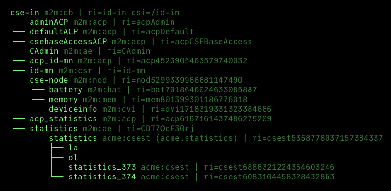

# Command Console

The CSE has a command console interface to show logging information, to execute build-in commands, to inspect resources, 
to show statistics, to plot graphs, and many more. The console is started automatically when the CSE is started and the 
console *type* is set to `rich` (the default). If the console *type* is set to `simple`, a more basic console is started, which only provides a minimal user interface.

The console can be accessed via the terminal where the CSE is running.


## Console Commands

The following commands are available:


| Key           | Description                                                              |
|---------------|--------------------------------------------------------------------------|
| `=`           | Print a separator line to the log                                        |
| `A`           | About                                                                    |
| `c`           | Show configuration                                                       |
| `C`           | Clear the console screen                                                 |
| `D`           | Delete resource                                                          |
| `E`           | Export resource tree to *data* directory                                 |
| `G`, `CTRL-G` | Plot graph once / continously (only for container)                       |
| `h`, `?`      | This help                                                                |
| `I`           | Inspect resource and child resources                                     |
| `i`, `CTRL-K` | Inspect resource once / continously                                      |
| `k`,          | Catalog of scripts                                                       |
| `l`           | Toggle screen logging on/off                                             |
| `L`           | Toggle through log levels                                                |
| `Q`, `CTRL-C` | Shutdown CSE                                                             |
| `r`           | Show CSE registrations                                                   |
| `s`, `CTRLS`  | Show statistics once / continously                                       |
| `t`           | Show resource tree                                                       |
| `T`, `CTRL-T` | Show child resource tree once / continously                              |
| `u`           | Open web UI                                                              |
| `w`           | Show workers and threads status                                          |
| `Z`           | Reset and restart the CSE                                                |
| `#`           | Toggle between the normal console and the [Text UI](../setup/TextUI.md). |


**Example**  
The CSE's resource tree can be shown by pressing the `t` key:

<figure markdown="1">
{:, style="height:80%;width:80%"},
<figcaption>ACME CSE's resource tree in the console</figcaption>
</figure>

In addition to the build-in commands, the console shows the [Script commands](../development/ACMEScript.md) with a configured [key binding](../development/ACMEScript-metatags.md#onkey).


## Minimal Console

The minimal console (console *type* set to `simple`) provides only a very basic user interface. It does not support most of the
above commands, but it still supports the `CTRL-C` (or `Q`) command to shutdown the CSE, and the `#` command to toggle between the minimal console and the [Text UI](../setup/TextUI.md). 

It is useful if you want to run the CSE with a console, but you don't need the advanced features of the rich console, or if you want to save system resources.


## Exporting Resources

With the console command `E` (export resource tree to *data* directory) one can export a resource and its child resources
to the current *data* directory as a shell script. The shell script runs *curl* commands to create the resources in the
same or another. It can be used to backup resources or to move resources from one CSE to another.

!!! Warning

	The exported shell script is not a backup of the CSE's database. It only contains the specified resources.

	The shell script does not contain any information about the CSE's configuration or the CSE's registrations at other CSEs.

	It is also possible that the shell script does not work for all resources, e.g. if referenced resources are missing or have other resource identifiers.


## Hiding Resources in the Console's Tree

Sometimes it could be useful in demonstrations if one would be able to hide resources from the console's resource tree.
That can be accomplished by listing these resources in the setting *[cse.console].hideResources*. 
Simple wildcards are allowed in this setting.

Example to hide all resources with resource identifiers starting with 'acp':

```ini title="Hide Resources"
[cse.console]
hideResources=acp*
```


## Supported Function Keys

The consoles and their emulations of different operating systems support different sets of function key bindings. The following
table lists the names that can be used, e.g. in scripts.

=== "POSIX (Linux, Mac OS)"

	| Supported (Function) Keys                         | Modifiers                                                           |
	|---------------------------------------------------|---------------------------------------------------------------------|
	| `A` - `Z`                                         | `CTRL`, `SHIFT`                                                     |
	| `F1` - `F12`                                      | `SHIFT`                                                             |
	| `UP`, `DOWN`, `LEFT`, `RIGHT`, `HOME`, `END`      | `SHIFT`, `CTRL`, `ALT`, `SHIFT_ALT`, `SHIFT_CTRL`, `SHIFT_CTRL_ALT` |
	| `PAGE_UP`, `PAGE_DOWN`                            | `ALT`                                                               |
	| `INSERT`, `DEL`, `BACKSPACE`, `LF`, `CR`, `SPACE` |                                                                     |
	| `TAB`                                             | `SHIFT`                                                             |

=== "MS Windows"

	| Supported (Function) Keys                    | Modifiers              |
	|----------------------------------------------|------------------------|
	| `A` - `Z`                                    | `CTRL`, `SHIFT`        |
	| `F1` - `F12`                                 | `SHIFT`, `CTRL`, `ALT` |
	| `UP`, `DOWN`, `LEFT`, `RIGHT`, `HOME`, `END` | `CTRL`, `ALT`          |
	| `PAGE_UP`, `PAGE_DOWN`                       | `CTRL`, `ALT`          |
	| `INSERT`, `DEL`, `LF`, `CR`, `SPACE`         |                        |
	| `BACKSPACE`, `TAB`                           | `CTRL`                 |

Note, that modifiers are prepend to key names with an underline, e.g. `SHIFT_CTRL_UP`.

