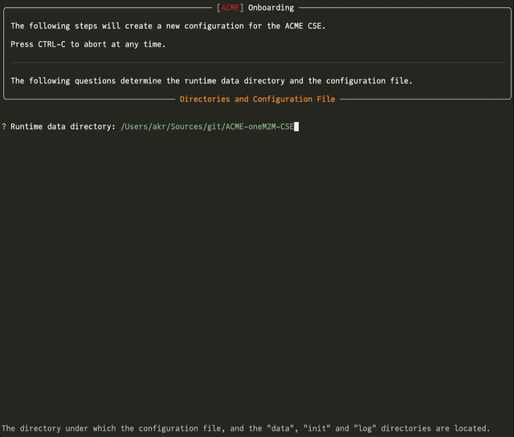

# Installation

## Pre-Requisites

ACME requires **Python 3.10** or newer. ACME has **not** been tested with the upcoming Python 3.13 yet.  
Install it with your favorite package manager or as part of a virtual environment.

## Installation and First Setup

### Installation

There are two ways to install the ACME CSE: using *pip* or by doing a manual installation.

=== "Using pip (Package Installation)"

	Run *pip* to install the ACME CSE from the Python Package Index (PyPI):

	```bash title="Installing ACME CSE"
	python -m pip install acmecse
	```

	This will install the latest version of the ACME CSE and all required dependencies. 

	You can also upgrade to the latest version by running:

	```bash title="Upgrading ACME CSE"
	python -m pip install --upgrade acmecse
	```

=== "Manual Installation"

	1. Install the ACME CSE by cloning the repository, or by downloading the [latest](https://github.com/ankraft/ACME-oneM2M-CSE/releases/latest){target=_new} release package, unpacking it, and copying the whole distribution to a new directory.  

		```bash title="Clone the Repository"
		git clone https://github.com/ankraft/ACME-oneM2M-CSE.git
		cd ACME-oneM2M-CSE
		```

	1. It is recommend to install the required packages by running the following command:

		```bash title="Installing Required Packages"
		python3 -m pip install -r requirements.txt
		```

		You may also install the packages manually, but make sure to install the exact versions as specified in the *requirements.txt* file.

		An alternative is to let ACME handle the installation automatically when running it for the first time (see below).


### Guided Onboarding

The ACME CSE can be configured by an interactive onboarding process when it is started for the first time. This process will create a configuration file that can be edited later.

1. Run the CSE for the first time.  
You can start the CSE by simply running it from the command line:

	=== "For Package Installation "

		Run the following command from the command line of your terminal program from **within any directory that uses the Python environment where you installed the package**:

		```bash title="Running the ACME CSE"
		acmecse
		```

	=== "For Manual Installation"

		Run the following command from the command line from **within the directory where you installed the CSE**:

		```bash title="Running the ACME CSE as a module"
		python3 -m acme
		```

	Please refer to the [Running](Running.md) documentation for more detailed instructions how to start and run the ACME CSE.

    If you have not installed the required packages during the installation ACME will ask you to install them now. This can be done by ACME automatically, or you can do it manually (see above).

	If no configuration file is found in the *base directory* then an interactive configuration process is started. The configuration is saved to a configuration file. e.g. *acme.ini* by default. 

	The *base directory* by default is the directory where the CSE is started from. This directory can be changed by the *--base-directory* (or *-dir*) command line argument to a different directory. 

	<figure>
	
	<figcaption>ACME CSE Guided Configuration</figcaption>
	</figure>

	After the configuration is saved, the CSE is started. with this configuration.

1.  <a id="guided-onboarding-2"></a>After terminating the CSE again you can edit that configuration file and add more settings if necessary.
	There are a lot of individual settings to configure here. Mostly, the defaults should be sufficient, but individual settings can be applied to each of the sections.  
	See the [Configuration](../setup/Configuration-introduction.md) documentation for further details, and the default configuration file [acme.ini.default](https://github.com/ankraft/ACME-oneM2M-CSE/blob/master/acme/init/acme.ini.default){target=_new}.


#### Stand-Alone Configuration Creation

If you want to configure the CSE without starting it, you can use the following command:

=== "For Package Installation "

	Run the following command from the command line of your terminal program from **within any directory that uses the Python environment where you installed the package**:

	```bash title="Running the onboarding tool"
	acmecse-onboarding acme.ini
	```

=== "For Manual Installation"

	Run the following command from the command line from **within the directory where you installed the CSE**:

	```bash title="Running the onboarding tool as a module"
	python3 -m acme.onboarding acme.ini
	```


This will start the configuration process and save the configuration to the specified file. The configuration file can be edited later as described [before](#guided-onboarding-2).


#### Guided Onboarding with a Zookeeper Configuration Service

If you want to use a [Zookeeper configuration service](../setup/Configuration-introduction.md#using-apache-zookeeper-for-configuration) instead of a local configuration file to manage the configuration of the CSE, you can create a configuration that is stored in Zookeeper. This can be done by passing the *--zookeeper-host* (and optionally *--zookeeper-port*) command line arguments to the onboarding tool:

=== "For Package Installation"
	```bash title="Running the onboarding tool with Zookeeper"
	acmecse-onboarding --zookeeper-host <host>
	```

=== "For Manual Installation"
	```bash title="Running the onboarding tool with Zookeeper as a module"
	python3 -m acme.onboarding --zookeeper-host <host>
	```

This will start the configuration process as before, but the configuration will be stored in Zookeeper instead of a local file.

Storing the configuration in Zookeeper is also possible when running the CSE for the first time. When you run the CSE with the [--config-zk-host](../setup/Running.md#command-line-arguments) command line argument, the CSE will start the onboarding process and store the configuration in Zookeeper.


## Installing the Development Version

If you want to install the development version of the ACME CSE, you can either clone the repository and check-out the *development* branch, or you can install the current stable development version from the Python Package Index (PyPI): 

```bash title="Installing the ACME CSE Development Version"
python -m pip install acmecse-dev
```

This command will install the latest development version of the ACME CSE and all required dependencies. It can be run in the same way as the stable version.

!!! warning "Development Version"
	The development version contains the latest changes, features, and bug fixes, but it is not stable and may contain bugs or incomplete features. It is not recommended for production use.
